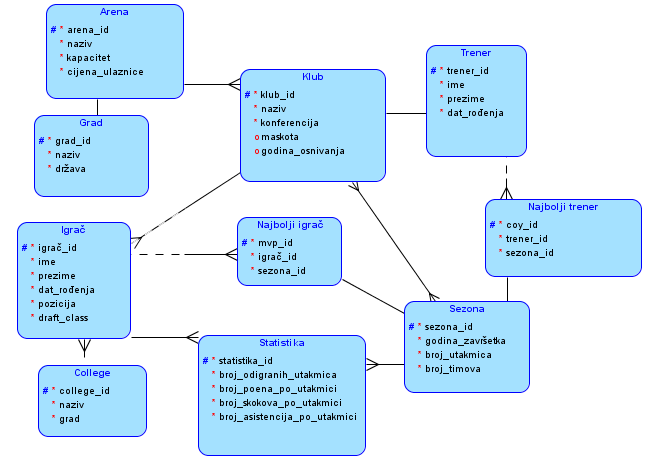
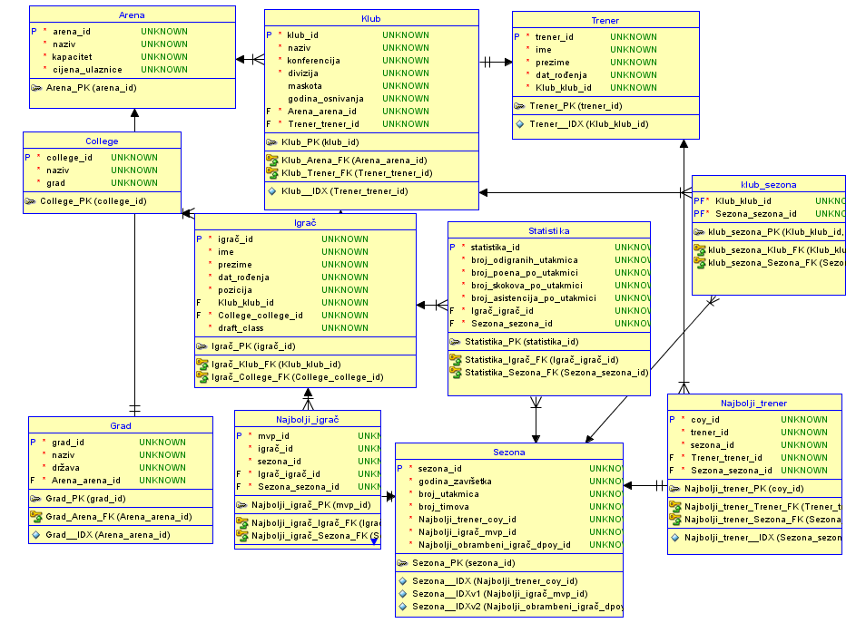

"#Database-for-NBA-fans" 

- Developed a simple database model for web pages aimed at an audience interested in basketball.
- Designed and implemented an MEV model using Oracle SQL Data Modeler to structure entities and attributes relevant to the organization of the basketball sport.

- Used Oracle SQL Developer to create tables, enter data and execute SQL queries.
 
- Focused on an intuitive presentation of the basketball organization, with the aim of bringing this sport closer to the people who play it
 they follow less.
